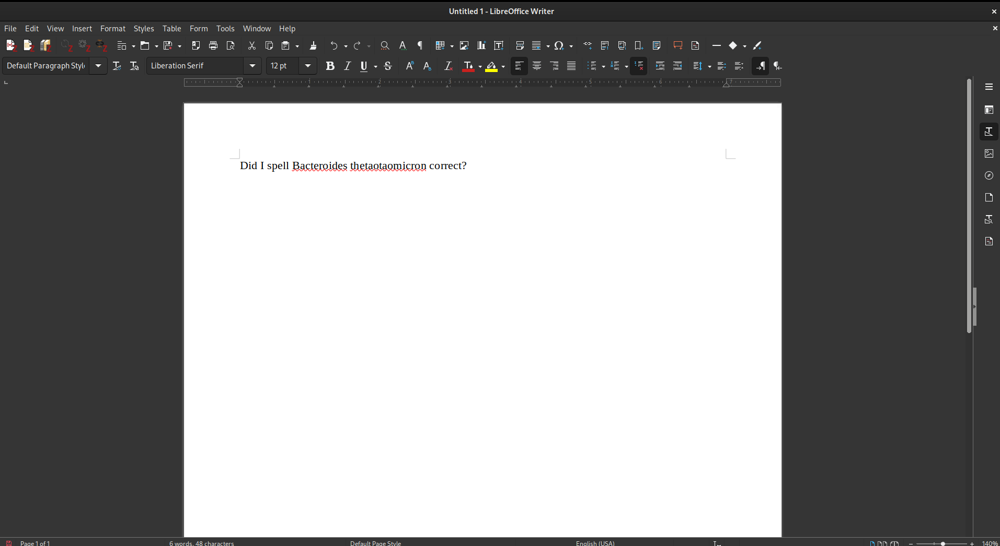

# The Taxonomy dictionary
## Libreoffice extension

This repository contains the [Libreoffice extension](https://extensions.libreoffice.org/en/extensions/show/27369) for [The Taxonomy Dictionary](https://github.com/kbagge/taxonomy_dictionary).
For further specification on sources and compilation of the dictionary, please see the Taxonomy Dictionary repository.

### Installation:
- Download the extension from the [Libreoffice extension page](https://extensions.libreoffice.org/en/extensions/show/27369).
- From within Libreoffice install the extension from file. Tools > Extension Manager > Add > Select the downloaded .oxt file.

### Use:
After installation the dictionary can be used out of the box, it is installed as "Latin". You need to change the language for each word that needs to be spellchecked, as it is often not practical to set the entire document to latin. 
I recommend the use of styles. This is an easy way to change language and italicize the taxa correct. You can even set up a keybinding, so when you press ie. "Ctrl + 9" with the pointer inside a word it will be italicized and set to latin spellchecking in one go. Keybindings can be set in Tools > Customize.. > Keyboard. For instructions on how to set up styles see below.

#### Spellchecking:
As we see below there are a lots of taxonomic terms that are not recognised by the enlglish spellchecker.

You can select a word you want to spellcheck for its taxonomic name and right click and set the language for the selection. If Latin is not available as in the screenshot below you can find it under "More".

Now you can see the relevant suggestions for autocorrection. Looks like I had a spelling mistanke, it is a good thing I had a taxonomy dictionary to help me correct my mistake.

#### Using styles:
You can use styles to apply various formats at the same time to selected text. This is convenient in taxonomy, cause you often want to italicize at the same time as you change language to latin.
Follow the steps below to set up a taxa style that can be used across documents.

Open the styles menu.

Click on character styles.

And now after selecting a word formatted in italics and with language set to latin click on "New style from selection" in the drop down menu as below.

Give the style a name, I suggest "Taxa".

You can now see the Taxa style is accesible in the character style list, and can select a new word and then double click on "Taxa" and it will be italicized and have the language set to latin.

For this style to be used in other documents it must be saved as a template. Go to File > Templates > Save as template.

Give it a name and select "styles" as template category.

To use the style in a new document it needs to be loaded. Go to the styles menu and select "Load Styles from Template".

You can see that the saved style is available, and is ready to be used thereafter in the new document.

